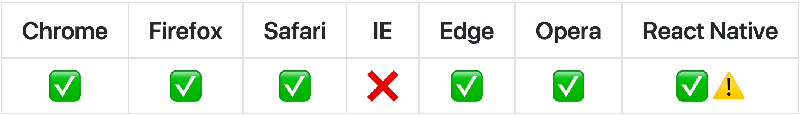

# React Easy State

Simple React state management. Made with :heart: and ES6 Proxies.

[](https://circleci.com/gh/solkimicreb/react-easy-state/tree/master) [](https://david-dm.org/solkimicreb/react-easy-state) [](https://coveralls.io/github/solkimicreb/react-easy-state?branch=master) [](https://bundlephobia.com/result?p=react-easy-state) [](https://www.npmjs.com/package/react-easy-state) [](https://www.npmjs.com/package/react-easy-state) [](https://twitter.com/intent/tweet?text=Simple%20React%20state%20management.%20Made%20with%20%E2%9D%A4%EF%B8%8F%20and%20ES6%20Proxies.&url=https://github.com/solkimicreb/react-easy-state&hashtags=reactjs,webdev,javascript)

<a href="#platform-support"></a>

**NEWS:** v6.1.2 fixed a nasty memory leak. Please upgrade to v6.1.2+ if you use a v6.x version already. Thanks!

<details>
<summary><strong>Table of Contents</strong></summary>
<!-- Do not edit the Table of Contents, instead regenerate with `npm run build-toc` -->

<!-- toc -->

- [Introduction](#introduction)
- [Installation](#installation)
- [Usage](#usage)
  - [Creating global stores](#creating-global-stores)
  - [Creating reactive views](#creating-reactive-views)
  - [Creating local stores](#creating-local-stores)
- [Examples with live demos](#examples-with-live-demos)
- [Articles](#articles)
- [Performance](#performance)
- [Platform support](#platform-support)
- [Alternative builds](#alternative-builds)
- [Contributing](#contributing)

<!-- tocstop -->

</details>

## Introduction

React Easy State is a practical state management library with two functions and two accompanying rules.

1.  Always wrap your components with `view()`.
2.  Always wrap your state store objects with `store()`.

```jsx
import React from 'react'
import { store, view } from 'react-easy-state'

const counter = store({ num: 0 })
const increment = () => counter.num++

export default view(() => <button onClick={increment}>{counter.num}</button>)
```

This is enough for it to automatically update your views when needed. It doesn't matter how you structure or mutate your state stores, any syntactically valid code works.

Check this [TodoMVC codesandbox](https://codesandbox.io/s/github/solkimicreb/react-easy-state/tree/master/examples/todo-mvc?module=%2Fsrc%2FtodosStore.js) or [raw code](/examples/todo-mvc/src/todosStore.js) for a more exciting example with nested data, arrays and computed values.

## Installation

`npm install react-easy-state`

<details>
<summary><strong>Setting up a quick project</strong></summary>
<p></p>

Easy State supports <a href="https://github.com/facebookincubator/create-react-app">Create React App</a> without additional configuration. Just run the following commands to get started.

```sh
npx create-react-app my-app
cd my-app
npm install react-easy-state
npm start
```

_You need npm 5.2+ to use npx._

</details>

## Usage

### Creating global stores

`store` creates a state store from the passed object and returns it. A state store behaves just like the passed object. (To be precise, it is a transparent reactive proxy of the original object.)

```js
import { store } from 'react-easy-state'

const user = store({ name: 'Rick' })
// stores behave like normal JS objects
user.name = 'Bob'
```

<details>
<summary>State stores may have arbitrary structure and they may be mutated in any syntactically valid way.</summary>
<p></p>

```js
import { store } from 'react-easy-state'

// stores can include any valid JS structure
// including nested data, arrays, Maps, Sets, getters, setters, inheritance, ...
const user = store({
  profile: {
    firstName: 'Bob',
    lastName: 'Smith',
    get name() {
      return `${user.firstName} ${user.lastName}`
    }
  },
  hobbies: ['programming', 'sports'],
  friends: new Map()
})

// stores may be mutated in any syntactically valid way
user.profile.firstName = 'Bob'
delete user.profile.lastName
user.hobbies.push('reading')
user.friends.set('id', otherUser)
```

</details>
<p></p>

<details>
<summary>Async operations can be expressed with the standard async/await syntax.</summary>
<p></p>

```js
import { store } from 'react-easy-state'

const userStore = store({
  user: {},
  async fetchUser() {
    userStore.user = await fetch('/user')
  }
})

export default userStore
```

</details>
<p></p>

<details>
<summary>State stores may import and use other state stores in their methods.</summary>
<p></p>

_userStore.js_

```js
import { store } from 'react-easy-state'

const userStore = store({
  user: {},
  async fetchUser() {
    userStore.user = await fetch('/user')
  }
})

export default userStore
```

_recipesStore.js_

```js
import { store } from 'react-easy-state'
import userStore from './userStore'

const recipesStore = store({
  recipes: [],
  async fetchRecipes() {
    recipesStore.recipes = await fetch(`/recipes?user=${userStore.user.id}`)
  }
})

export default recipesStore
```

</details>
<p></p>

<details>
<summary>Wrap your state stores with <code>store</code> as early as possible.</summary>
<p></p>

```js
// DON'T DO THIS
const person = { name: 'Bob' }
person.name = 'Ann'

export default store(person)
```

```js
// DO THIS INSTEAD
const person = store({ name: 'Bob' })
person.name = 'Ann'

export default person
```

The first example wouldn't trigger re-renders on the `person.name = 'Ann'` mutation, because it is targeted at the raw object. Mutating the raw - none `store`-wrapped object - won't schedule renders.

</details>
<p></p>

<details>
<summary>Avoid using the <code>this</code> keyword in the methods of your state stores.</summary>
<p></p>

```jsx
import { store, view } from 'react-easy-state'

const counter = store({
  num: 0,
  increment() {
    // DON'T DO THIS
    this.num++
    // DO THIS INSTEAD
    counter.num++
  }
})

export default view(() => <div onClick={counter.increment}>{counter.num}</div>)
```

`this.num++` won't work, because `increment` is passed as a callback and loses its `this`. You should use the direct object reference - `counter` - instead of `this`.

</details>

### Creating reactive views

Wrapping your components with `view` turns them into reactive views. A reactive view re-renders whenever a piece of store - used inside its render - changes.

```jsx
import React from 'react'
import { view, store } from 'react-easy-state'

// this is a global state store
const user = store({ name: 'Bob' })

// this is re-rendered whenever user.name changes
export default view(() => (
  <div>
    <input value={user.name} onChange={ev => (user.name = ev.target.value)} />
    <div>Hello {user.name}!</div>
  </div>
))
```

<details>
<summary><strong>Wrap ALL of your components with <code>view</code> - including class and function ones - even if they don't seem to directly use a store.</strong></summary>
<p></p>

```jsx
import { view, store } from 'react-easy-state'

const appStore = store({
  user: { name: 'Ann' }
})

const App = view(() => (
  <div>
    <h1>My App</h1>
    <Profile user={appStore.user} />
  </div>
))

// DO THIS
const Profile = view(({ user }) => <p>Name: {user.name}</p>)

// DON'T DO THIS
// This won't re-render on appStore.user.name = 'newName' like mutations
const Profile = ({ user }) => <p>Name: {user.name}</p>
```

</details>
<p></p>

<details>
<summary>A single reactive component may use multiple stores inside its render.</summary>
<p></p>

```jsx
import React from 'react'
import { view, store } from 'react-easy-state'

const user = store({ name: 'Bob' })
const timeline = store({ posts: ['react-easy-state'] })

// this is re-rendered whenever user.name or timeline.posts[0] changes
export default view(() => (
  <div>
    <div>Hello {user.name}!</div>
    <div>Your first post is: {timeline.posts[0]}</div>
  </div>
))
```

</details>
<p></p>

<details>
<summary><code>view</code> implements an optimal <code>shouldComponentUpdate</code> (or <code>memo</code>) for your components.</summary>
<p></p>

- Using `PureComponent` or `memo` will provide no additional performance benefits.

- Defining a custom `shouldComponentUpdate` may rarely provide performance benefits when you apply some use case specific heuristics inside it.

</details>
<p></p>

<details>
<summary>Reactive renders are batched. Multiple synchronous store mutations won't result in multiple re-renders of the same component.</summary>
<p></p>

```jsx
import React from 'react'
import { view, store, batch } from 'react-easy-state'

const user = store({ name: 'Bob', age: 30 })

function mutateUser() {
  user.name = 'Ann'
  user.age = 32
}

// calling `mutateUser` will only trigger a single re-render of the below component
// even though it mutates the store two times in quick succession
export default view(() => (
  <div onClick={mutateUser}>
    name: {user.name}, age: {user.age}
  </div>
))
```

If you mutate your stores multiple times synchronously from **exotic task sources**, multiple renders may rarely happen. If you experience performance issues you can batch changes manually with the `batch` function. `batch(fn)` executes the passed function immediately and batches any subsequent re-renders until the function execution finishes.

```jsx
import React from 'react'
import { view, store, batch } from 'react-easy-state'

const user = store({ name: 'Bob', age: 30 })

function mutateUser() {
  // this makes sure the state changes will cause maximum one re-render,
  // no matter where this function is getting invoked from
  batch(() => {
    user.name = 'Ann'
    user.age = 32
  })
}

export default view(() => (
  <div>
    name: {user.name}, age: {user.age}
  </div>
))
```

> **NOTE:** The React team plans to improve render batching in the future. The `batch` function and built-in batching may be deprecated and removed in the future in favor of React's own batching.

</details>
<p></p>

<details>
<summary>Always apply <code>view</code> as the latest (innermost) wrapper when you combine it with other Higher Order Components.</summary>
<p></p>

```jsx
import { view } from 'react-easy-state'
import { withRouter } from 'react-router-dom'
import { withTheme } from 'styled-components'

const Comp = () => <div>A reactive component</div>

// DO THIS
withRouter(view(Comp))
withTheme(view(Comp))

// DON'T DO THIS
view(withRouter(Comp))
view(withTheme(Comp))
```

</details>
<p></p>

<details>
<summary>Usage with (pre v4.4) React Router.</summary>
<p></p>

- If routing is not updated properly, wrap your `view(Comp)` - with the `Route`s inside - in `withRouter(view(Comp))`. This lets react-router know when to update.

- The order of the HOCs matter, always use `withRouter(view(Comp))`.

This is not necessary if you use React Router 4.4+. You can find more details and some reasoning about this in [this react-router docs page](https://github.com/ReactTraining/react-router/blob/master/packages/react-router/docs/guides/blocked-updates.md).

</details>
<p></p>

<details>
<summary>Passing nested data to third party components.</summary>
<p></p>

Third party helpers - like data grids - may consist of many internal components which can not be wrapped by `view`, but sometimes you would like them to re-render when the passed data mutates. Traditional React components re-render when their props change by reference, so mutating the passed reactive data won't work in these cases. You can solve this issue by deep cloning the observable data before passing it to the component. This creates a new reference for the consuming component on every store mutation.

```jsx
import React from 'react'
import { view, store } from 'react-easy-state'
import Table from 'rc-table'
import cloneDeep from 'lodash/cloneDeep'

const dataStore = store({
  items: [
    {
      product: 'Car',
      value: 12
    }
  ]
})

export default view(() => <Table data={cloneDeep(dataStore.items)} />)
```

</details>

### Creating local stores

A singleton global store is perfect for something like the current user, but sometimes having local component states is a better fit. Just create a store inside a function component or as a class component property in these cases.

#### Local stores in function components

```jsx
import React from 'react'
import { view, store } from 'react-easy-state'

export default view(() => {
  const counter = store({ num: 0 })
  const increment = () => counter.num++
  return <button={increment}>{counter.num}</div>
})
```

**Local stores in functions rely on React hooks. They require React and React DOM v16.8+ or React Native v0.59+ to work.**

<details>
<summary>You can use any React hook - including <code>useState</code> - in function components, Easy State won't interfere with them.</summary>
<p></p>

```jsx
import React from 'react'
import { view, store } from 'react-easy-state'

export default view(() => {
  const [name, setName] = useState('Ann')
  const user = store({ age: 30 })
  return (
    <div>
      <input value={name} onChange={ev => setName(ev.target.value)} />
      <input value={user.age} onChange={ev => (user.age = ev.target.value)} />
    </div>
  )
})
```

</details>

#### Local stores in class components

```jsx
import React, { Component } from 'react'
import { view, store } from 'react-easy-state'

class Counter extends Component {
  counter = store({ num: 0 })
  increment = () => counter.num++

  render() {
    return <button onClick={this.increment}>{this.counter.num}</button>
  }
}

export default view(Counter)
```

<details>
<summary>You can also use vanilla <code>setState</code> in your class components, Easy State won't interfere with it.</summary>
<p></p>

```jsx
import React, { Component } from 'react'
import { view, store } from 'react-easy-state'

class Profile extends Component {
  state = { name: 'Ann' }
  user = store({ age: 30 })

  setName = ev => this.setState({ name: ev.target.value })
  setAge = ev => (this.user.age = ev.target.value)

  render() {
    return (
      <div>
        <input value={this.state.name} onChange={this.setName} />
        <input value={this.user.age} onChange={this.setAge} />
      </div>
    )
  }
}

export default view(Profile)
```

</details>
<p></p>

<details>
<summary>Don't name local stores as <code>state</code>. It may conflict with linter rules, which guard against direct state mutations.</summary>
<p></p>

```jsx
import React, { Component } from 'react'
import { view, store } from 'react-easy-state'

class Profile extends Component {
  // DON'T DO THIS
  state = store({})
  // DO THIS
  user = store({})
  render() {}
}
```

</details>
<p></p>

<details>
<summary>Deriving local stores from props (<code>getDerivedStateFromProps</code>).</summary>
<p></p>

Class components wrapped with `view` have an extra static `deriveStoresFromProps` lifecycle method, which works similarly to the vanilla `getDerivedStateFromProps`.

```jsx
import React, { Component } from 'react'
import { view, store } from 'react-easy-state'

class NameCard extends Component {
  userStore = store({ name: 'Bob' })

  static deriveStoresFromProps(props, userStore) {
    userStore.name = props.name || userStore.name
  }

  render() {
    return <div>{this.userStore.name}</div>
  }
}

export default view(NameCard)
```

Instead of returning an object, you should directly mutate the received stores. If you have multiple local stores on a single component, they are all passed as arguments - in their definition order - after the first props argument.

</details>

---

## Examples with live demos

#### Beginner

- [Clock Widget](https://solkimicreb.github.io/react-easy-state/examples/clock/build) ([source](/examples/clock/)) ([codesandbox](https://codesandbox.io/s/github/solkimicreb/react-easy-state/tree/master/examples/clock)) ([react-native source](/examples/native-clock/)) ([react-native sandbox](https://snack.expo.io/@git/github.com/solkimicreb/react-easy-state:examples/native-clock)): a reusable clock widget with a tiny local state store.
- [Stopwatch](https://solkimicreb.github.io/react-easy-state/examples/stop-watch/build) ([source](/examples/stop-watch/)) ([codesandbox](https://codesandbox.io/s/github/solkimicreb/react-easy-state/tree/master/examples/stop-watch)) ([tutorial](https://hackernoon.com/introducing-react-easy-state-1210a156fa16)): a stopwatch with a mix of normal and computed state properties.

#### Advanced

- [TodoMVC](https://solkimicreb.github.io/react-easy-state/examples/todo-mvc/build) ([source](/examples/todo-mvc/)) ([codesandbox](https://codesandbox.io/s/github/solkimicreb/react-easy-state/tree/master/examples/todo-mvc)): a classic TodoMVC implementation with a lot of computed data and implicit reactivity.
- [Contacts Table](https://solkimicreb.github.io/react-easy-state/examples/contacts/build) ([source](/examples/contacts/)) ([codesandbox](https://codesandbox.io/s/github/solkimicreb/react-easy-state/tree/master/examples/contacts)): a data grid implementation with a mix of global and local state.
- [Beer Finder](https://solkimicreb.github.io/react-easy-state/examples/beer-finder/build) ([source](/examples/beer-finder/)) ([codesandbox](https://codesandbox.io/s/github/solkimicreb/react-easy-state/tree/master/examples/beer-finder)) ([tutorial](https://medium.com/@solkimicreb/design-patterns-with-react-easy-state-830b927acc7c)): an app with async actions and a mix of local and global state, which finds matching beers for your meal.

## Articles

- [Introducing React Easy State](https://blog.risingstack.com/introducing-react-easy-state/): making a simple stopwatch.
- [Stress Testing React Easy State](https://medium.com/@solkimicreb/stress-testing-react-easy-state-ac321fa3becf): demonstrating Easy State's reactivity with increasingly exotic state mutations.
- [Design Patterns with React Easy State](https://medium.com/@solkimicreb/design-patterns-with-react-easy-state-830b927acc7c): demonstrating async actions and local and global state management through a beer finder app.
- [The Ideas Behind React Easy State](https://medium.com/dailyjs/the-ideas-behind-react-easy-state-901d70e4d03e): a deep dive under the hood of Easy State.

## Performance

You can compare Easy State with plain React and other state management libraries with the below benchmarks. It performs a bit better than MobX and similarly to Redux.

- [js-framework-benchmark](https://github.com/krausest/js-framework-benchmark) ([source](https://github.com/krausest/js-framework-benchmark/tree/master/react-v16.1.0-easy-state-v4.0.1-keyed)) ([results](https://rawgit.com/krausest/js-framework-benchmark/master/webdriver-ts-results/table.html))

## Platform support

- Node: 6 and above
- Chrome: 49 and above
- Firefox: 38 and above
- Safari: 10 and above
- Edge: 12 and above
- Opera: 36 and above
- React Native: 0.59 and above

_This library is based on non polyfillable ES6 Proxies. Because of this, it will never support IE._

## Alternative builds

This library detects if you use ES6 or commonJS modules and serve the right format to you. The default bundles use ES6 features, which may not yet be supported by some minifier tools. If you experience issues during the build process, you can switch to one of the ES5 builds from below.

- `react-easy-state/dist/es.es6.js` exposes an ES6 build with ES6 modules.
- `react-easy-state/dist/es.es5.js` exposes an ES5 build with ES6 modules.
- `react-easy-state/dist/cjs.es6.js` exposes an ES6 build with commonJS modules.
- `react-easy-state/dist/cjs.es5.js` exposes an ES5 build with commonJS modules.

If you use a bundler, set up an alias for `react-easy-state` to point to your desired build. You can learn how to do it with webpack [here](https://webpack.js.org/configuration/resolve/#resolve-alias) and with rollup [here](https://github.com/rollup/rollup-plugin-alias#usage).

## Contributing

Contributions are always welcome. Just send a PR against the master branch or open a new issue. Please make sure that the tests and the linter pass and the coverage remains decent. Thanks!
